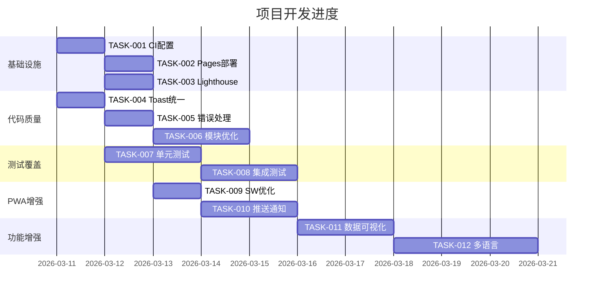

# 任务分解表

## 项目信息
- **项目名称**: 人格星球探索 (MBTI Test)
- **版本**: 3.2.0
- **创建日期**: 2026-03-11
- **负责人**: Development Team

---

## 任务优先级定义
| 级别 | 标识 | 说明 |
|------|------|------|
| P0 | 🔴 紧急 | 阻塞性问题，必须立即处理 |
| P1 | 🟠 高 | 核心功能，影响用户体验 |
| P2 | 🟡 中 | 重要功能，可延后处理 |
| P3 | 🟢 低 | 优化改进，按需处理 |

---

## 任务列表

### Phase 1: 基础设施 (Infrastructure)

#### TASK-001: GitHub Actions CI配置
| 属性 | 值 |
|------|-----|
| **优先级** | P1 🟠 |
| **状态** | 待开始 |
| **预估工时** | 2h |
| **依赖** | 无 |
| **描述** | 配置GitHub Actions持续集成流水线，实现自动代码检查和测试 |
| **验收标准** | 1. 每次PR触发lint检查 2. 每次PR触发测试运行 3. 检查失败时阻止合并 |
| **技术方案** | 创建 `.github/workflows/ci.yml` 配置文件 |

#### TASK-002: GitHub Pages自动部署
| 属性 | 值 |
|------|-----|
| **优先级** | P1 🟠 |
| **状态** | 待开始 |
| **预估工时** | 1h |
| **依赖** | TASK-001 |
| **描述** | 配置main分支自动部署到GitHub Pages |
| **验收标准** | 1. main分支推送后自动部署 2. 部署成功后可访问 3. 部署失败有通知 |
| **技术方案** | 使用 `peaceiris/actions-gh-pages` action |

#### TASK-003: Lighthouse CI配置
| 属性 | 值 |
|------|-----|
| **优先级** | P2 🟡 |
| **状态** | 待开始 |
| **预估工时** | 2h |
| **依赖** | TASK-001 |
| **描述** | 配置Lighthouse CI进行性能监控 |
| **验收标准** | 1. 每次部署运行Lighthouse审计 2. 性能分数低于阈值时警告 3. 生成性能报告 |
| **技术方案** | 创建 `.github/workflows/lighthouse.yml` |

---

### Phase 2: 代码质量 (Code Quality)

#### TASK-004: 统一Toast实现
| 属性 | 值 |
|------|-----|
| **优先级** | P1 🟠 |
| **状态** | 待开始 |
| **预估工时** | 2h |
| **依赖** | 无 |
| **描述** | 消除core.js、comments.js、messages.js等文件中的重复Toast代码，统一使用utils.js中的实现 |
| **验收标准** | 1. 所有模块使用utils.showToast 2. 删除重复的showToast函数 3. 功能正常工作 |
| **技术方案** | 重构各模块，引用utils.showToast |

#### TASK-005: 添加错误边界处理
| 属性 | 值 |
|------|-----|
| **优先级** | P1 🟠 |
| **状态** | 待开始 |
| **预估工时** | 3h |
| **依赖** | 无 |
| **描述** | 为关键功能添加try-catch错误处理，防止页面崩溃 |
| **验收标准** | 1. 所有关键函数有错误处理 2. 错误信息友好展示 3. 不影响其他功能运行 |
| **技术方案** | 添加全局错误处理器和局部try-catch |

#### TASK-006: 代码模块化优化
| 属性 | 值 |
|------|-----|
| **优先级** | P2 🟡 |
| **状态** | 待开始 |
| **预估工时** | 4h |
| **依赖** | TASK-004 |
| **描述** | 优化core.js代码结构，拆分大函数，提高可维护性 |
| **验收标准** | 1. 单个函数不超过50行 2. 职责单一原则 3. 代码可读性提升 |
| **技术方案** | 函数拆分、提取公共逻辑 |

---

### Phase 3: 测试覆盖 (Testing)

#### TASK-007: 单元测试完善
| 属性 | 值 |
|------|-----|
| **优先级** | P1 🟠 |
| **状态** | 待开始 |
| **预估工时** | 4h |
| **依赖** | 无 |
| **描述** | 为核心模块添加单元测试，提高测试覆盖率 |
| **验收标准** | 1. 测试覆盖率≥80% 2. 所有测试通过 3. 关键路径有测试 |
| **技术方案** | 扩展tests/test-runner.js |

#### TASK-008: 集成测试添加
| 属性 | 值 |
|------|-----|
| **优先级** | P2 🟡 |
| **状态** | 待开始 |
| **预估工时** | 3h |
| **依赖** | TASK-007 |
| **描述** | 添加端到端集成测试，验证完整流程 |
| **验收标准** | 1. 测试完整答题流程 2. 测试数据存储流程 3. 测试导出功能 |
| **技术方案** | 使用Playwright或类似工具 |

---

### Phase 4: PWA增强 (PWA Enhancement)

#### TASK-009: Service Worker优化
| 属性 | 值 |
|------|-----|
| **优先级** | P2 🟡 |
| **状态** | 待开始 |
| **预估工时** | 3h |
| **依赖** | 无 |
| **描述** | 优化Service Worker缓存策略，提升离线体验 |
| **验收标准** | 1. 静态资源优先缓存 2. 离线可访问核心功能 3. 缓存更新机制完善 |
| **技术方案** | 更新service-worker.js缓存策略 |

#### TASK-010: 推送通知功能
| 属性 | 值 |
|------|-----|
| **优先级** | P3 🟢 |
| **状态** | 待开始 |
| **预估工时** | 4h |
| **依赖** | TASK-009 |
| **描述** | 添加Web Push推送通知功能 |
| **验收标准** | 1. 用户可订阅通知 2. 每日运势提醒 3. 测试完成提醒 |
| **技术方案** | 使用Web Push API |

---

### Phase 5: 功能增强 (Feature Enhancement)

#### TASK-011: 数据可视化增强
| 属性 | 值 |
|------|-----|
| **优先级** | P2 🟡 |
| **状态** | 待开始 |
| **预估工时** | 4h |
| **依赖** | 无 |
| **描述** | 添加雷达图、趋势图等数据可视化组件 |
| **验收标准** | 1. 结果页显示雷达图 2. 历史趋势对比 3. 响应式适配 |
| **技术方案** | 使用Chart.js或ECharts |

#### TASK-012: 多语言支持
| 属性 | 值 |
|------|-----|
| **优先级** | P3 🟢 |
| **状态** | 待开始 |
| **预估工时** | 6h |
| **依赖** | 无 |
| **描述** | 添加国际化支持，支持中英文切换 |
| **验收标准** | 1. 中英文切换功能 2. 所有文本可配置 3. 语言偏好保存 |
| **技术方案** | 创建i18n模块，JSON语言包 |

---

## 任务状态跟踪

---

## 风险评估

| 风险项 | 可能性 | 影响 | 缓解措施 |
|--------|--------|------|----------|
| 浏览器兼容性问题 | 中 | 高 | 添加polyfill，测试主流浏览器 |
| localStorage容量限制 | 低 | 中 | 实现数据压缩，定期清理 |
| CDN资源不可用 | 低 | 高 | 添加fallback本地资源 |
| Service Worker缓存问题 | 中 | 中 | 版本控制，强制更新机制 |

---

**文档版本**: 1.0.0  
**最后更新**: 2026-03-11
